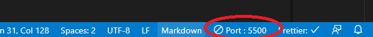

# Full Stack Software Engineering: Web Development Day 4 :rocket:

### Main Topics :zap:

- Bootstrap Practice
- Russian Doll Rule

### Directions :flashlight:

- Go to the LMS and follow the exercises:
  [Day 4](https://xccelerate.talentlms.com/unit/view/id:3477)

### How it works :open_book:

Directions: Clone this repository, open the files and fill them out according to the directions

Method one:

- Opening index.html:

  - Right click on index.html
  - Hover over "Open with..."
  - Select your code editor (to change code) OR chrome (to see it)
  - Whenever you change your code, make sure to refresh the chrome page

  Method Two:

- Opening index.html from VS code:

  - Follow method one and open your file within VS code
  - Install the extension Live Server
  - Right click on the index.html and then select open with Live Server, when you are finished, click the close server button on the bottom right of VS code.

  

- Running javascript files:

  - Open your terminal
  - Change directory in your folder (cd desktop, cd ftwd_web (or wherever you saved it))
  - Type in node filename.js (make sure you have npm installed)

## Practice Questions :telescope:

- [ ] Practice: Bootstrap Practice

## Exercises Due :athletic_shoe:

- [ ] Exercise A: Bootstrap Website & Russian Doll Rule
      Create a clone of this website: http://www.dagusa.com/

* [ ] Finish the 'What is one thing that I learned from doing this project?' in the readme

### Tips :tipping_hand_woman:

- We highly encourage you to follow practice the exercises; reading about code is not always enough, sometimes it's also important to practice implementing the specific steps. Don't worry if it feels difficult - that's normal. The important thing is to keep going, even when it feels hard :relaxed:

- If you get stuck, try to break down the problem. What small thing can you figure out first? Remember, instructors have a no touching your key board rule (we can help guide you, but won't debug for you!). Part of being a software engineer IS solving problems. It's a marathon, not a sprint :running_woman:

- Other debugging tips
  - [ ] Write down the logic of your code
  - [ ] Re-read documentation
  - [ ] Look at example code on github
  - [ ] Go slow. Do one thing at a time. You got this :muscle:

## What is one thing that I learned from doing this project? :books:

Learnt more about different utilities of Bootstrap and more familiar with the grid concept.
Practice makes perfect
